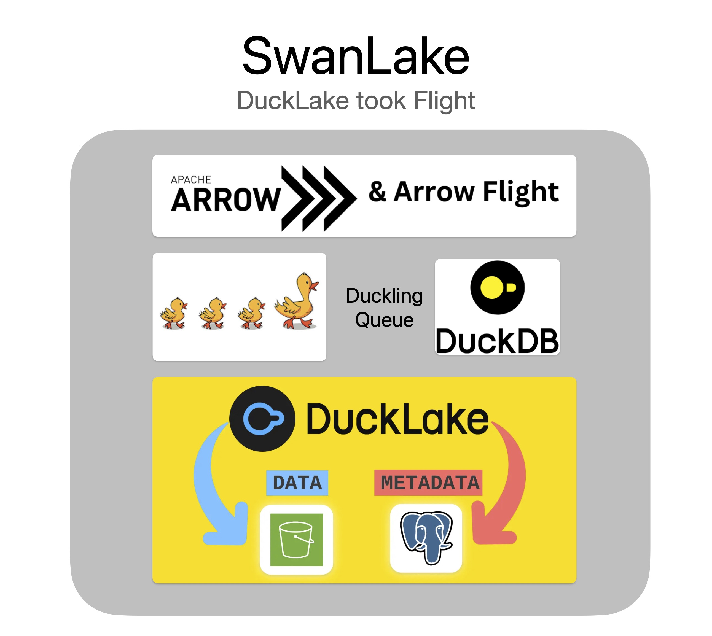

[](https://coveralls.io/github/swanlake-io/swanlake?branch=main)

# SwanLake

SwanLake is an Arrow Flight SQL server backed by DuckDB, enabling fast data analytics and ingestion with datalake support.

<!---->


## Quick Start

First start the SwanLake server:

```bash
# From the swanlake root directory
RUST_LOG=info cargo run --bin swanlake

# Or using Docker
docker run --rm -p 4214:4214  ghcr.io/swanlake-io/swanlake:latest
```

Then run the Rust interactive client example:

```bash
cargo run --bin swanlake-cli --features="cli"
```

## Architecture

- **Arrow Flight SQL Server**: High-performance SQL interface over gRPC for efficient querying.
- **DuckLake**: Extensions for datalake integrations, supporting scalable storage solutions.

## Use Cases

- Building datalakes on Postgres and S3 for unified data access.
- Rapid ingestion of logs, metrics, and streaming data.
- High-speed querying using DuckDB and Arrow for analytics.

## Deployment

SwanLake supports serverless deployment via Docker. Pull the latest image from [GitHub Container Registry](https://github.com/swanlake-io/swanlake/pkgs/container/swanlake).

Customize with environment variables; see [CONFIGURATION.md](CONFIGURATION.md) for details.

## License

Licensed under the MIT License. See [LICENSE](LICENSE) for details.
