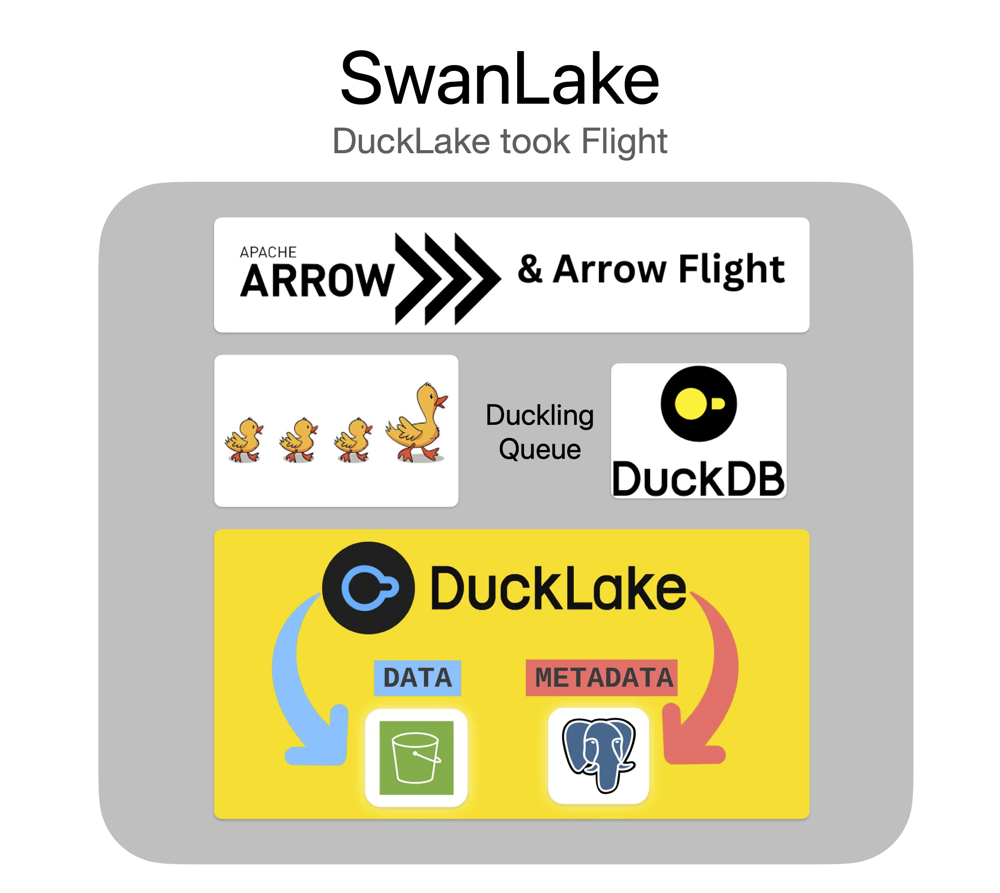
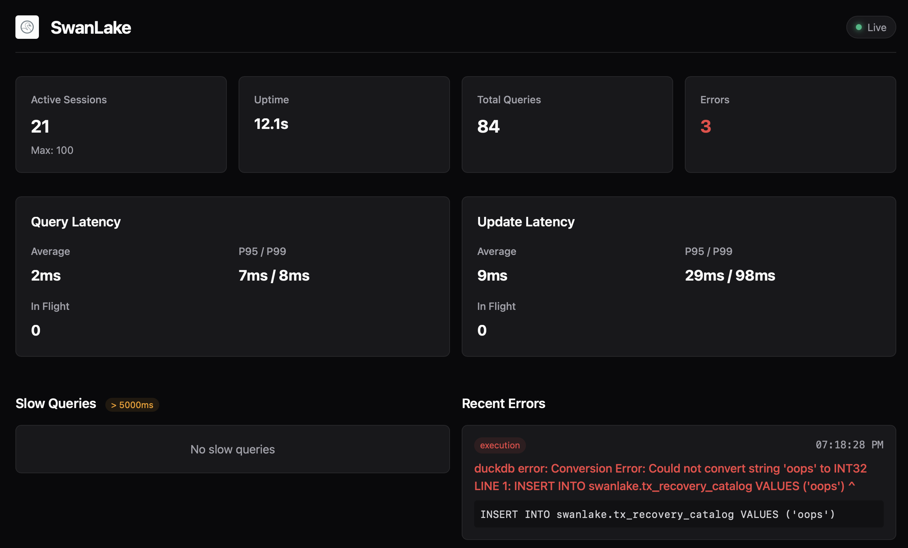

[](https://codecov.io/github/swanlake-io/swanlake)
[](https://github.com/duckdb/duckdb/releases/tag/v1.5.2)
[![DuckLake](https://img.shields.io/badge/DuckLake-v1.0-blue?logo=)](https://ducklake.select)

# SwanLake

SwanLake is an Arrow Flight SQL server backed by DuckDB, enabling fast data analytics and ingestion with datalake support.

<!---->


## Quick Start

First start the SwanLake server:

```bash
# From the swanlake root directory
RUST_LOG=info cargo run --bin swanlake

# Or using Docker
docker run --rm -p 4214:4214  ghcr.io/swanlake-io/swanlake:latest
```

Then run the Rust interactive client example:

```bash
cargo run --bin swanlake-cli --features="cli"
```

## Architecture

- **Arrow Flight SQL Server**: High-performance SQL interface over gRPC for efficient querying.
- **DuckLake**: Extensions for datalake integrations, supporting scalable storage solutions.

## Use Cases

- Building datalakes on Postgres and S3 for unified data access.
- Rapid ingestion of logs, metrics, and streaming data.
- High-speed querying using DuckDB and Arrow for analytics.

## Status Page

SwanLake includes a built-in status page for real-time monitoring of your server. Access it at `http://localhost:4215` (default) to view:

- Active sessions and uptime
- Query and update latency metrics (average, P95, P99)
- Slow queries and recent errors

<!---->


Configure the status page using environment variables:
- `SWANLAKE_STATUS_ENABLED` (default: `true`)
- `SWANLAKE_STATUS_HOST` and `SWANLAKE_STATUS_PORT` (default: `0.0.0.0:4215`)

See [CONFIGURATION.md](CONFIGURATION.md) for more details.

## Deployment

SwanLake supports serverless deployment via Docker. Pull the latest image from [GitHub Container Registry](https://github.com/swanlake-io/swanlake/pkgs/container/swanlake).

Customize with environment variables; see [CONFIGURATION.md](CONFIGURATION.md) for details.

## License

Licensed under the MIT License. See [LICENSE](LICENSE) for details.
